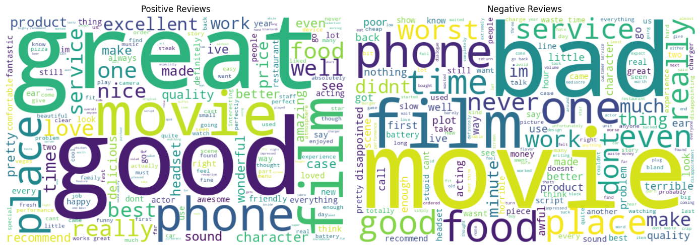

# 🧠 Sentiment Analysis of Consumer Reviews

This project applies machine learning and NLP to classify sentiment from user reviews on Amazon, IMDb, and Yelp.

## 📊 Overview

- Data Source: UCI ML Repository (Sentiment Labelled Sentences)
- Goal: Classify reviews as **positive** or **negative**
- Models Used: Naive Bayes and Logistic Regression
- Achieved Accuracy: ~81%

## 🧪 Tools Used
- Python, NLTK, Scikit-learn
- Jupyter Notebook
- Matplotlib & WordCloud

## 📈 Visualization

## 📂 File Descriptions

- `sentiment_analysis.ipynb`: Complete notebook with data loading, cleaning, model training, and evaluation
- `sentiment_distribution.png`: Shows the count of positive vs negative reviews across platforms

## 👤 Author

Achyuth Kumar Miryala  
M.S. Data Science, University of North Texas
